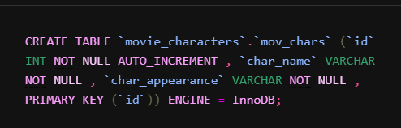
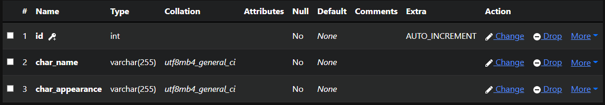
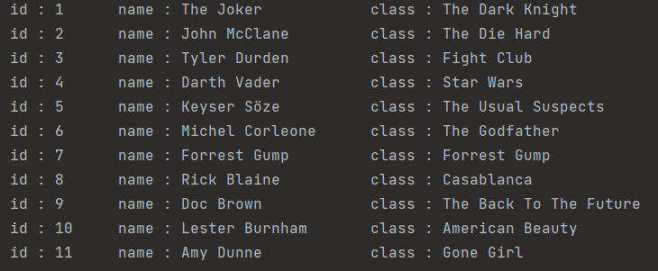
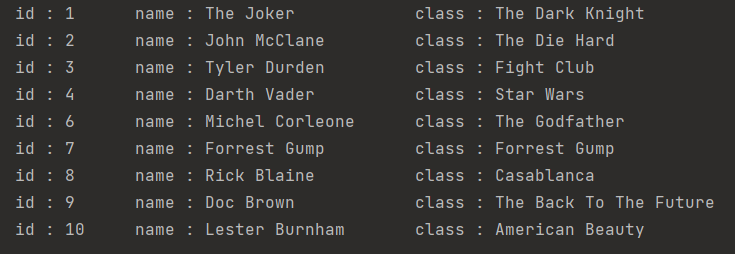
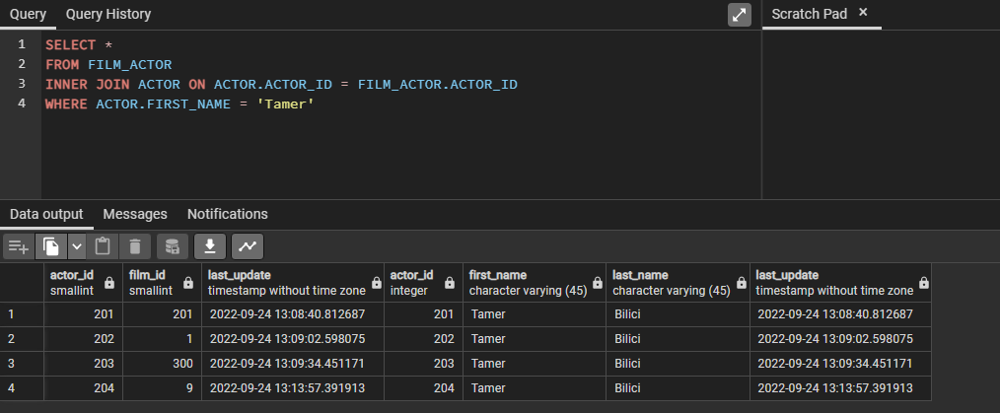

# JDBC

## Java Database Connectivity

## Features

- JDBC Basics
- JDBC CRUD Examples
- JDBC PreparedStatement

## Tech

- [Java](https://bell-sw.com/pages/downloads/) - Java is a powerful general-purpose programming language-

- [Ampps](https://ampps.com) - AMPPS is a bloat-free stack which comes with just one PHP, Apache, MySQL, MongoDB,
  Softaculous and phpMyAdmin which makes it light weight

- [PostgreSQL](https://www.postgresql.org) - PostgreSQL is a powerful, open source object-relational database system
  that uses and extends the SQL language combined with many features that safely store

- [Intellij Idea](https://www.jetbrains.com/idea/) - IntelliJ IDEA is an Integrated Development Environment (IDE) for
  JVM languages designed to maximize developer productivity.

- [Lombok](https://projectlombok.org/download) - Project Lombok (from now on, Lombok) is an annotation-based Java
  library that allows you to reduce boilerplate code.

- [PostgreSQL Drive](https://jdbc.postgresql.org/download/) - The PostgreSQL JDBC Driver allows Java programs to connect to
  a PostgreSQL database using standard, database independent Java code.

- [MySQL Drive](https://www.mysql.com/products/connector/) - MySQL provides standards-based drivers for JDBC, ODBC, and
  .Net enabling developers to build database applications in their language of choice
  
- [Sample Database](https://www.postgresqltutorial.com/postgresql-getting-started/postgresql-sample-database/) - PostgreSQL sample database that you can use for learning and practicing PostgreSQL.  

## Out

> with MySQL
- Create Table

- Table structure

- Table after insert opr.

- After delete opr.

> with PostgreSQL

- SQL Transaction 

